# Detailed Project Report — VoiceUp Platform

> A civic grievance posting and tracking platform built on Django (backend) + React (frontend), where citizens post local issues, others vote/comment, and assigned admins move them through a workflow till resolution.


## Table of Contents

1. Project Overview
2. Project Plan (start to end)
3. Data Flow Diagrams (DFD)
4. Flow Charts of all important flows
5. System Design (end to end)
6. Pseudo Codes of important logics
7. Testing Report (functional + structural + non-functional)
8. Final Notes


---

## 1. Project Overview

VoiceUp is a web platform for citizens of india where they can raise local problems, share photo/video proof, get community attention through votes and comments, and let assigned officials move the case through a fixed workflow till it gets resolved or closed. The system is built so that public users and admin users use the *same* platform but with different views and permissions.

The main idea is simple. The moment a problem is posted, it should not just sit in some table. It should reach the correct admin automatically, and people should be able to see what is happening with that problem at any point. So the design has both a public side (feed, detail, profile, posting, voting, commenting, sharing) and an admin side (dashboard, grievances list, grievance detail page, workflow stage update, internal notes, assignment config).

Some important things which make this project a bit non-trivial:

- Issues get auto-assigned to a particular admin based on category mapping, not randomly.
- Posting of an issue is **idempotent**, so if user retries because of network glitch, no duplicate post is created.
- Trending score uses recency + engagement so old high-vote posts don't dominate forever.
- All workflow transition notes done by admins are visible publicly, but internal admin-only notes stay internal.
- Theme toggle (dark / light) is available everywhere including login and signup pages.
- Mobile users get a camera capture short cut, desktop user just gets file picker (which is correct).
- Personal profile page lets a logged in user manage their own posts (view, edit, delete) at one place.

This report covers the whole engineering side of it. That means how it was planned, how data flows, what design choices were taken, what algorithms were used (in plain pseudo code), and how it was tested.


---

## 2. Project Plan (start to end)

This is the actual phase-by-phase plan that was followed during development. Everything is written from a real execution point of view, not just a textbook timeline.

### 2.1 Phases of the project

1. **Phase 1**: Idea finalising and requirement gathering
2. **Phase 2**: System design and DB design
3. **Phase 3**: Backend implementation (core models + APIs)
4. **Phase 4**: Frontend implementation (public side)
5. **Phase 5**: Admin module (workflow + dashboard + assignment)
6. **Phase 6**: Reliability and UX hardening (idempotent post, atomic media, owner edit/delete, profile page)
7. **Phase 7**: Visual polish (cards, comments preview, theme, filters)
8. **Phase 8**: Testing, bug fixes, deployment readiness


### 2.2 Phase wise activities and deliverables

#### Phase 1 — Requirement gathering

- Listed problem categories that civic platforms commonly need (infrastructure, public services, environment, etc.).
- Decided that anonymous posting is required, because some citizens are scared to attach their identity.
- Decided that admin should not see "everything mixed". They should see only the issues which are mapped to their assignment bucket as initiator.
- Decided to keep workflow stages closer to real bureaucratic flow: Pending → Acknowledged → Assigned to Team → Resolution Done → Validated → Closed (Remarks).
- Output of this phase: a written requirements list which became base for design.

#### Phase 2 — System design and DB design

- Picked Django + DRF for backend and React + Vite + Tailwind + shadcn/ui for frontend.
- DB design decisions:
  - One Issue model with engagement counters denormalised (`upvotes_count`, `downvotes_count`, `comments_count`, `views_count`) to avoid heavy aggregation on every list call.
  - Separate `Tag`, `Category`, and `AssignmentCategory` so admin grouping and citizen tags are independent.
  - `UserProfile` separated from Django User so we can extend without touching auth.
  - `WorkflowTransition` as an audit trail of who did what stage change.
- Output: ER design + endpoint plan.

#### Phase 3 — Backend implementation

- Built core models, serializers, viewsets.
- JWT authentication using SimpleJWT, with login by username OR email.
- Vote toggling logic (add / change / remove same vote).
- Trending sort with database safe expression (no SQLite-only function).
- Defensive fallback added so if trending sort ever errors, API silently falls back to recent ordering instead of returning 500.

#### Phase 4 — Frontend implementation (public side)

- Pages: Index (landing), Feed, Issue Detail, Create Issue, Login, Signup, NotFound.
- Reusable components: Navbar, IssueCard, FilterSidebar, ThemeToggle.
- Auth tokens stored in localStorage. On 401, refresh flow runs and retries silently.
- Feed reads URL params (`search`, `sort_by`) so direct deep linking works.

#### Phase 5 — Admin module

- Admin layout with route protection: only `is_staff` users get in.
- Admin dashboard: total grievances, pending count, last 7 days, resolved count, status breakdown.
- Admin grievances list with filtering (status, search) and sorting (latest first).
- Admin grievance detail with three action sections: status/visibility actions, workflow management, admin notes.
- Admin assignment config page: choose which staff is initiator for each assignment category.

#### Phase 6 — Reliability and UX hardening

This phase addressed real bugs and polish issues:

- Added a unique `submission_token` per create attempt to make creation idempotent.
- Wrapped issue + media creation inside an atomic transaction so partial success cannot happen anymore.
- Added permissions: only the author can edit / delete their own issue.
- Added Profile page with "my issues" + edit + delete.
- Tag length increased and tag normalisation (lowercase, single-spaced, deduped) added.
- Camera button shown only on mobile-like contexts (because desktop doesn't support `capture` properly).

#### Phase 7 — Visual polish

- Issue card layout reworked: title, description, image right side, top-2 comments preview under description, tags, footer.
- Top comments preview stays inside left text column so it does not bloat the card.
- Admin comment box bg darkened.
- Public processing timeline shows workflow transition notes for all stages.

#### Phase 8 — Testing and deployment readiness

- Functional smoke tests across all major endpoints (issue create, dedup retry, edit, delete, mine, admin notes, workflow advance).
- Lint + production build for frontend.
- `python manage.py check` for backend.
- `.gitignore` cleaned up so pyc / cache / env files do not enter git.
- Migrations run cleanly and db tested against the new constraints.


### 2.3 Milestones (in order)

| # | Milestone | What was achieved |
|---|-----------|-------------------|
| M1 | Auth ready | Login / signup / JWT working end to end |
| M2 | Issue lifecycle | Post + media + view + delete (basic) |
| M3 | Engagement | Voting and commenting working |
| M4 | Public feed | Filtering + sorting + search |
| M5 | Admin module | Dashboard + grievances + workflow + notes |
| M6 | Auto-assignment | Category → initiator mapping live |
| M7 | Reliability | Idempotent posting + atomic uploads + author-only edit/delete |
| M8 | Profile page | User-owned posts manageable from one place |
| M9 | Polish + theme | Cards, comments preview, theme toggle |
| M10 | Verified release | All flows tested end to end |


### 2.4 Tools and tech used

- **Frontend**: React 18, Vite, TypeScript, Tailwind, shadcn/ui, lucide-react, react-router-dom, tanstack query, next-themes
- **Backend**: Django, Django REST Framework, SimpleJWT, Pillow (for thumbnails)
- **Database**: SQLite for dev, can move to Postgres in prod (queries are DB-agnostic now)
- **Build**: Vite for frontend bundle
- **Auth**: JWT (access + refresh)
- **Styling**: Tailwind utility classes + design tokens (HSL)
- **Misc**: ESLint for FE lint, Django's system checks for BE


### 2.5 Risk register (and how each one was handled)

| Risk | What could go wrong | Mitigation actually done |
|------|---------------------|---------------------------|
| Duplicate post on retry | User clicks twice / network glitch creates duplicate | Submission token + DB unique constraint per author |
| Trending crash on prod DB | SQLite-only SQL fails on Postgres | Replaced with ORM expressions + fallback to recent on DB error |
| Partial media upload | Issue saved but media missing silently | Whole creation moved inside atomic transaction; invalid files rejected up front |
| Unauthorised editing of another user's post | Anyone could PATCH/DELETE | Added `IsAuthorOrReadOnly` permission |
| Camera UX confusion on desktop | Desktop ignored `capture="environment"` and showed file picker | Camera button only shown on mobile-like contexts |
| Bad data in tags | Whitespace or case duplicates create many copies | Tag normalisation + uniqueness slug logic |
| Filter UI on admin not actually filtering | `filterset_fields` was used but DjangoFilterBackend was not enabled | Replaced with explicit `get_queryset` filters in admin viewset |


---

## 3. Data Flow Diagrams (DFD)

The DFD is written in Mermaid blocks so it renders as a diagram in any markdown viewer that supports mermaid.

### 3.1 Level 0 — Context Diagram

This shows the platform as one box and the external entities that interact with it.

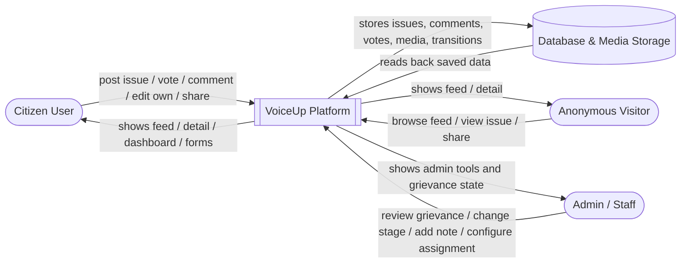
```mermaid
flowchart LR
    citizen([Citizen User])
    visitor([Anonymous Visitor])
    admin([Admin / Staff])
    system[[VoiceUp Platform]]
    storage[(Database & Media Storage)]

    citizen -- "post issue / vote / comment / edit own / share" --> system
    visitor -- "browse feed / view issue / share" --> system
    admin -- "review grievance / change stage / add note / configure assignment" --> system
    system -- "stores issues, comments, votes, media, transitions" --> storage
    storage -- "reads back saved data" --> system
    system -- "shows feed / detail / dashboard / forms" --> citizen
    system -- "shows feed / detail" --> visitor
    system -- "shows admin tools and grievance state" --> admin
```

External entities:

- **Citizen user**: logged in citizen who posts, votes, comments, edits own.
- **Anonymous visitor**: not logged in, can only read.
- **Admin**: staff user who manages grievances workflow and assignment.

The platform is one big logical system here.


### 3.2 Level 1 — Major processes inside the platform

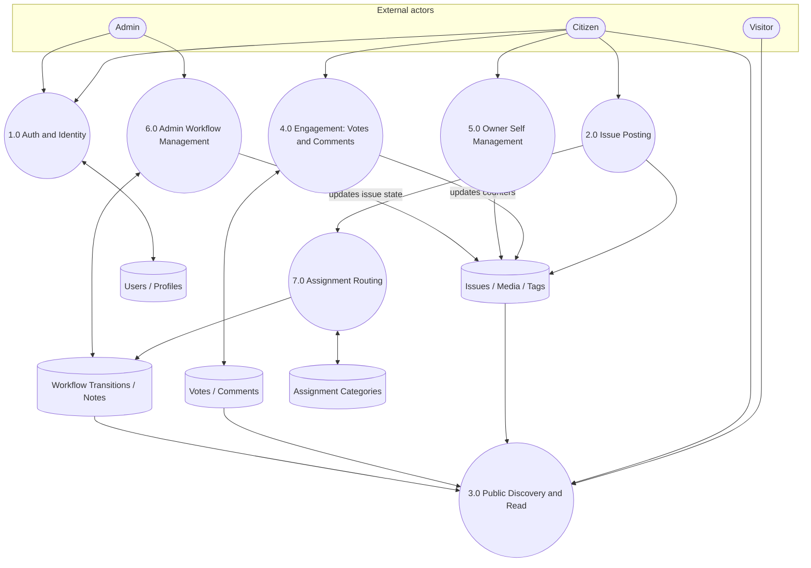
```mermaid
flowchart TB
    subgraph EXT[External actors]
      c([Citizen])
      v([Visitor])
      a([Admin])
    end

    p1((1.0 Auth and Identity))
    p2((2.0 Issue Posting))
    p3((3.0 Public Discovery and Read))
    p4((4.0 Engagement: Votes and Comments))
    p5((5.0 Owner Self Management))
    p6((6.0 Admin Workflow Management))
    p7((7.0 Assignment Routing))

    db1[(Users / Profiles)]
    db2[(Issues / Media / Tags)]
    db3[(Votes / Comments)]
    db4[(Workflow Transitions / Notes)]
    db5[(Assignment Categories)]

    c --> p1
    a --> p1
    p1 <--> db1

    c --> p2
    p2 --> db2
    p2 --> p7
    p7 <--> db5
    p7 --> db4

    v --> p3
    c --> p3
    db2 --> p3
    db3 --> p3
    db4 --> p3

    c --> p4
    p4 <--> db3
    p4 -- "updates counters" --> db2

    c --> p5
    p5 <--> db2

    a --> p6
    p6 <--> db4
    p6 -- "updates issue state" --> db2
```

Process explanation in plain words:

- **1.0 Auth and Identity**: handles signup, login, JWT issue, profile lookup. Talks to Users table.
- **2.0 Issue Posting**: citizen posts an issue with media. Sends it to the routing process for auto-assignment.
- **3.0 Public Discovery and Read**: feed + issue detail. Reads from issues, comments, transitions.
- **4.0 Engagement**: vote and comment on issue. Updates counters on issue.
- **5.0 Owner Self Management**: edit / delete own issue from profile or detail.
- **6.0 Admin Workflow Management**: admin moves stage, adds notes, updates status.
- **7.0 Assignment Routing**: when issue is created, route it to an initiator admin based on category mapping.


### 3.3 Level 2 — Issue Posting (process 2.0)

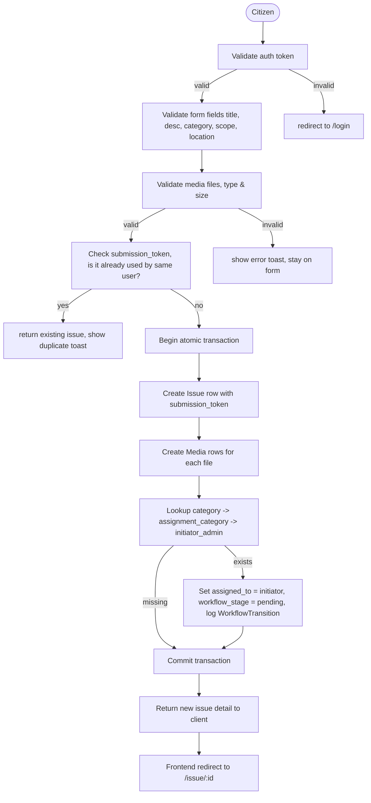
```mermaid
flowchart TB
    user([Citizen]) --> step1
    step1[Validate auth token] -->|valid| step2
    step1 -->|invalid| redirect_login[redirect to /login]

    step2[Validate form fields title, desc, category, scope, location] --> step3
    step3[Validate media files, type & size] -->|valid| step4
    step3 -->|invalid| toast_err1[show error toast, stay on form]

    step4[Check submission_token, is it already used by same user?] -->|yes| return_existing[return existing issue, show duplicate toast]
    step4 -->|no| step5

    step5[Begin atomic transaction] --> step6
    step6[Create Issue row with submission_token] --> step7
    step7[Create Media rows for each file] --> step8
    step8[Lookup category -> assignment_category -> initiator_admin] -->|exists| step9
    step8 -->|missing| step10
    step9[Set assigned_to = initiator, workflow_stage = pending, log WorkflowTransition] --> step10
    step10[Commit transaction] --> step11
    step11[Return new issue detail to client] --> show_redirect[Frontend redirect to /issue/:id]
```


### 3.4 Level 2 — Admin Workflow Management (process 6.0)

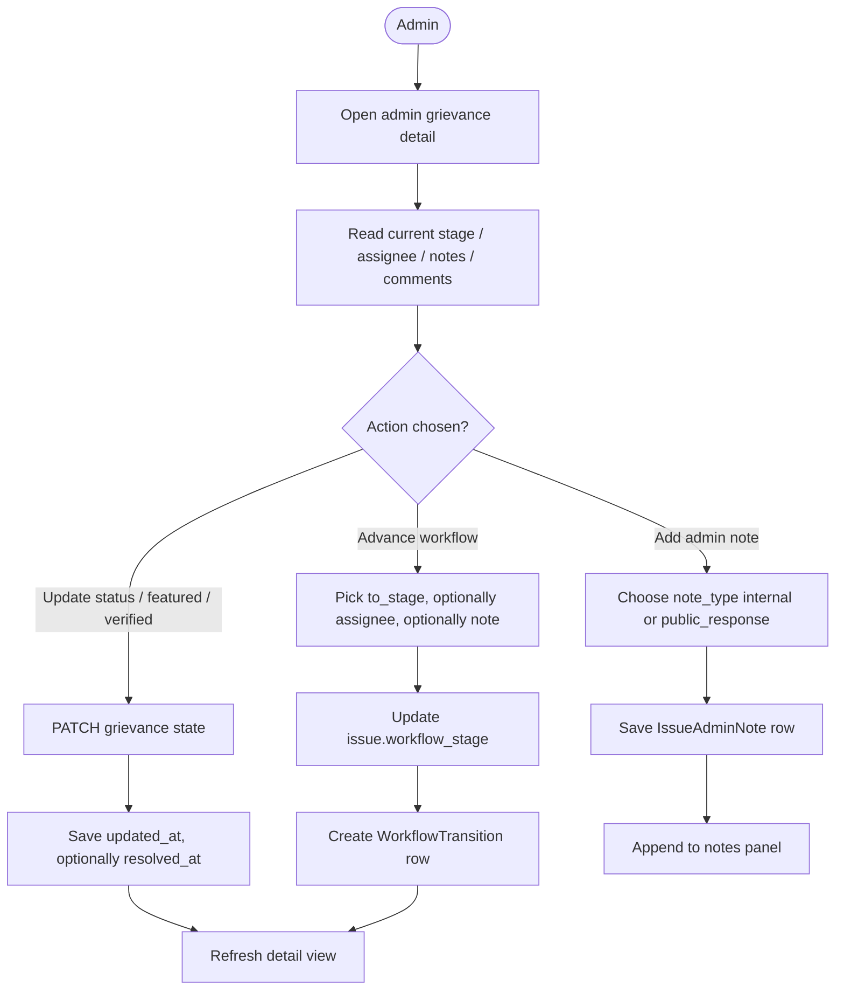
```mermaid
flowchart TB
    admin([Admin]) --> a1[Open admin grievance detail]
    a1 --> a2[Read current stage / assignee / notes / comments]
    a2 --> a3{Action chosen?}

    a3 -->|Update status / featured / verified| s1[PATCH grievance state]
    s1 --> s2[Save updated_at, optionally resolved_at]
    s2 --> s3[Refresh detail view]

    a3 -->|Advance workflow| w1[Pick to_stage, optionally assignee, optionally note]
    w1 --> w2[Update issue.workflow_stage]
    w2 --> w3[Create WorkflowTransition row]
    w3 --> s3

    a3 -->|Add admin note| n1[Choose note_type internal or public_response]
    n1 --> n2[Save IssueAdminNote row]
    n2 --> n3[Append to notes panel]
```


### 3.5 Level 2 — Voting on an Issue

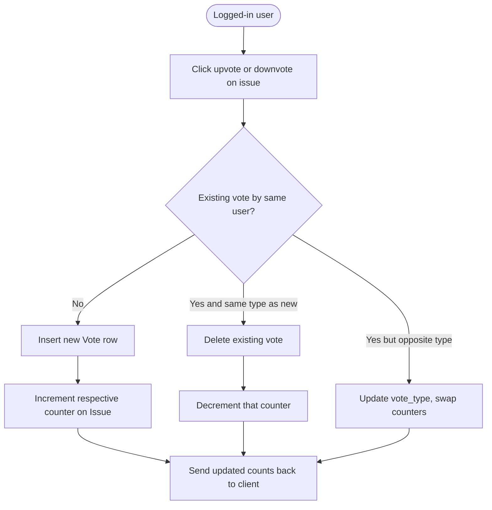
```mermaid
flowchart TB
    user([Logged-in user]) --> v1[Click upvote or downvote on issue]
    v1 --> v2{Existing vote by same user?}

    v2 -->|No| v3[Insert new Vote row]
    v3 --> v4[Increment respective counter on Issue]
    v4 --> v8[Send updated counts back to client]

    v2 -->|Yes and same type as new| v5[Delete existing vote]
    v5 --> v6[Decrement that counter]
    v6 --> v8

    v2 -->|Yes but opposite type| v7[Update vote_type, swap counters]
    v7 --> v8
```


---

## 4. Flow Charts

These are the most important flows of the system in flow chart form.

### 4.1 User Registration Flow

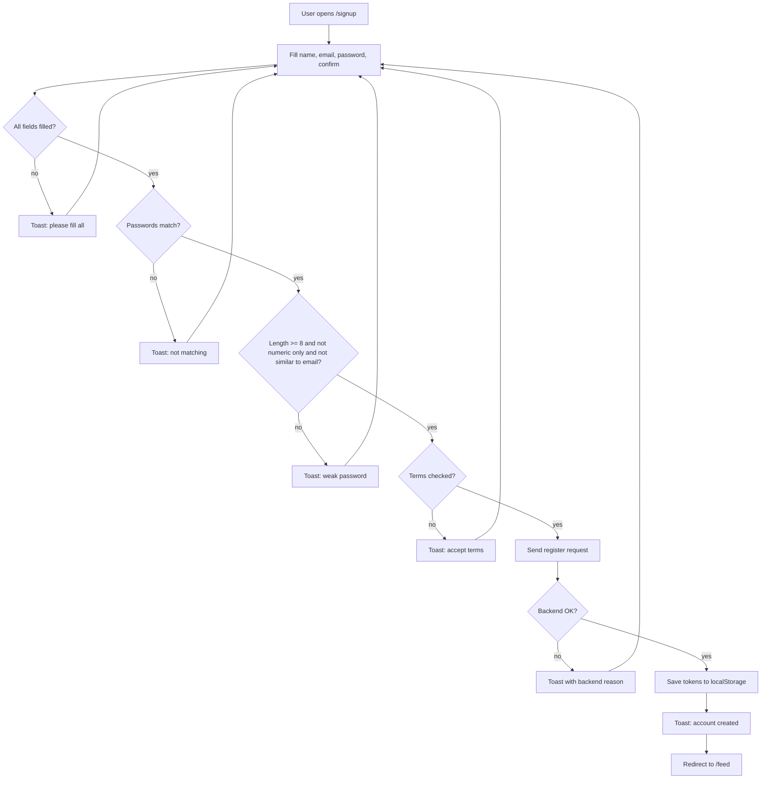
```mermaid
flowchart TD
    A[User opens /signup] --> B[Fill name, email, password, confirm]
    B --> C{All fields filled?}
    C -- no --> X1[Toast: please fill all] --> B
    C -- yes --> D{Passwords match?}
    D -- no --> X2[Toast: not matching] --> B
    D -- yes --> E{Length >= 8 and not numeric only and not similar to email?}
    E -- no --> X3[Toast: weak password] --> B
    E -- yes --> F{Terms checked?}
    F -- no --> X4[Toast: accept terms] --> B
    F -- yes --> G[Send register request]
    G --> H{Backend OK?}
    H -- no --> X5[Toast with backend reason] --> B
    H -- yes --> I[Save tokens to localStorage]
    I --> J[Toast: account created]
    J --> K[Redirect to /feed]
```


### 4.2 Login Flow

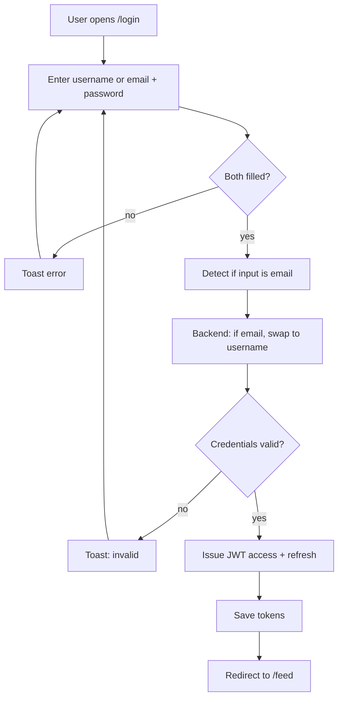
```mermaid
flowchart TD
    A[User opens /login] --> B[Enter username or email + password]
    B --> C{Both filled?}
    C -- no --> E1[Toast error] --> B
    C -- yes --> D[Detect if input is email]
    D --> E[Backend: if email, swap to username]
    E --> F{Credentials valid?}
    F -- no --> E2[Toast: invalid] --> B
    F -- yes --> G[Issue JWT access + refresh]
    G --> H[Save tokens]
    H --> I[Redirect to /feed]
```


### 4.3 Create Issue Flow

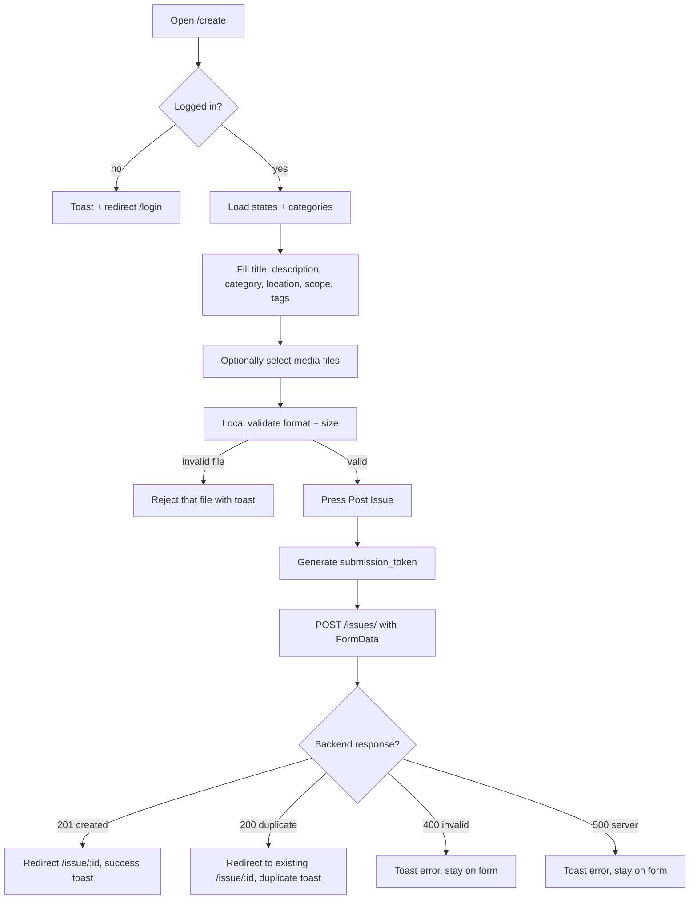
```mermaid
flowchart TD
    A[Open /create] --> B{Logged in?}
    B -- no --> R1[Toast + redirect /login]
    B -- yes --> C[Load states + categories]
    C --> D[Fill title, description, category, location, scope, tags]
    D --> E[Optionally select media files]
    E --> F[Local validate format + size]
    F -- invalid file --> X1[Reject that file with toast]
    F -- valid --> G[Press Post Issue]
    G --> H[Generate submission_token]
    H --> I[POST /issues/ with FormData]
    I --> J{Backend response?}
    J -- 201 created --> K[Redirect /issue/:id, success toast]
    J -- 200 duplicate --> L[Redirect to existing /issue/:id, duplicate toast]
    J -- 400 invalid --> M[Toast error, stay on form]
    J -- 500 server --> N[Toast error, stay on form]
```


### 4.4 Edit Own Issue Flow

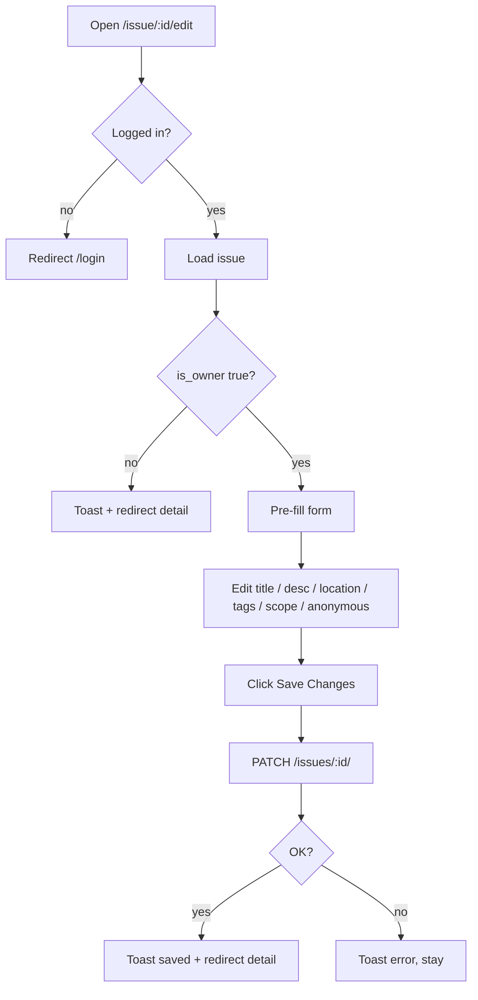
```mermaid
flowchart TD
    A[Open /issue/:id/edit] --> B{Logged in?}
    B -- no --> R1[Redirect /login]
    B -- yes --> C[Load issue]
    C --> D{is_owner true?}
    D -- no --> R2[Toast + redirect detail]
    D -- yes --> E[Pre-fill form]
    E --> F[Edit title / desc / location / tags / scope / anonymous]
    F --> G[Click Save Changes]
    G --> H[PATCH /issues/:id/]
    H --> I{OK?}
    I -- yes --> J[Toast saved + redirect detail]
    I -- no --> K[Toast error, stay]
```


### 4.5 Delete Own Issue Flow

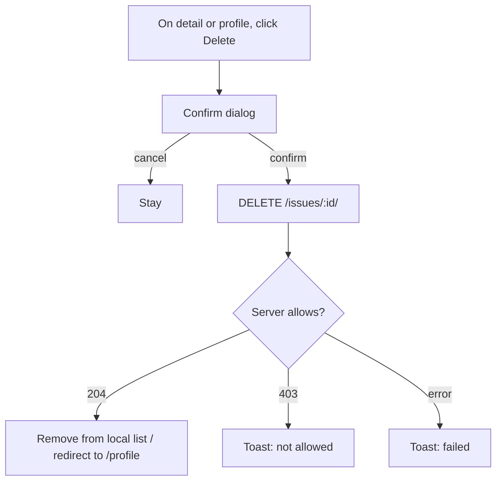
```mermaid
flowchart TD
    A[On detail or profile, click Delete] --> B[Confirm dialog]
    B -- cancel --> X[Stay]
    B -- confirm --> C[DELETE /issues/:id/]
    C --> D{Server allows?}
    D -- 204 --> E[Remove from local list / redirect to /profile]
    D -- 403 --> F[Toast: not allowed]
    D -- error --> G[Toast: failed]
```


### 4.6 Comment Posting Flow

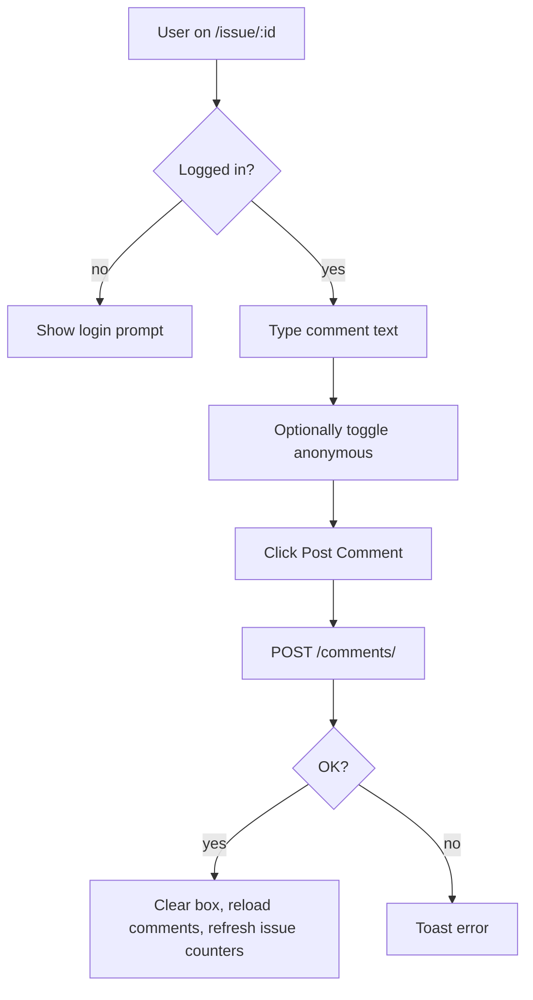
```mermaid
flowchart TD
    A[User on /issue/:id] --> B{Logged in?}
    B -- no --> P1[Show login prompt]
    B -- yes --> C[Type comment text]
    C --> D[Optionally toggle anonymous]
    D --> E[Click Post Comment]
    E --> F[POST /comments/]
    F --> G{OK?}
    G -- yes --> H[Clear box, reload comments, refresh issue counters]
    G -- no --> I[Toast error]
```


### 4.7 Voting on Issue Flow (with state toggle)

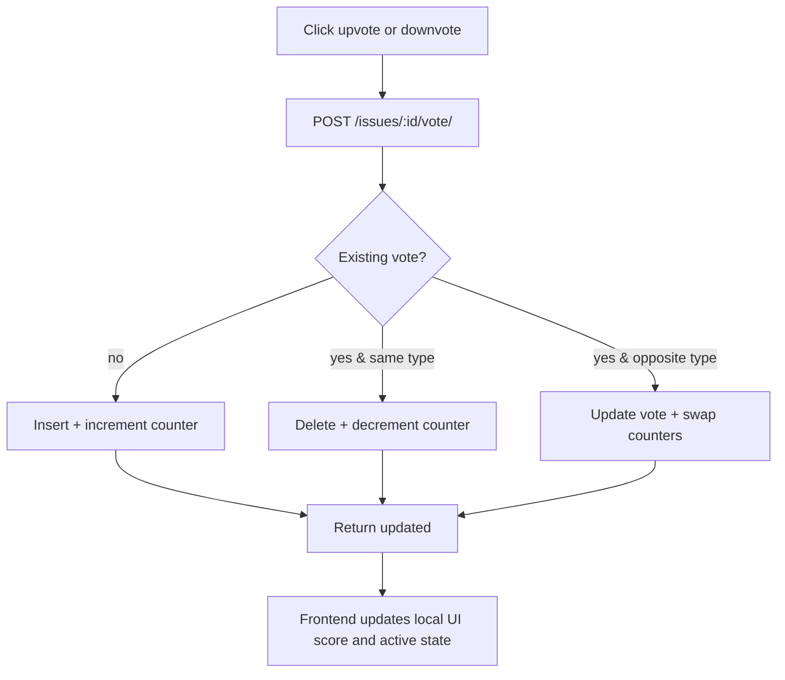
```mermaid
flowchart TD
    A[Click upvote or downvote] --> B[POST /issues/:id/vote/]
    B --> C{Existing vote?}
    C -- no --> D[Insert + increment counter] --> Z[Return updated]
    C -- yes & same type --> E[Delete + decrement counter] --> Z
    C -- yes & opposite type --> F[Update vote + swap counters] --> Z
    Z --> G[Frontend updates local UI score and active state]
```


### 4.8 Admin Workflow Transition Flow

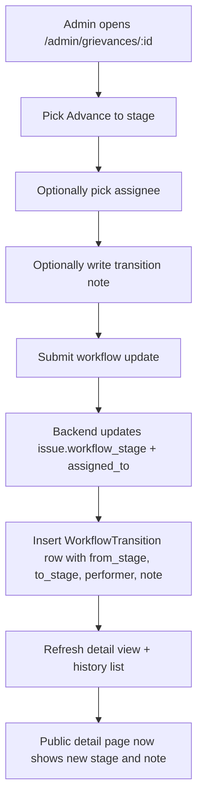
```mermaid
flowchart TD
    A[Admin opens /admin/grievances/:id] --> B[Pick Advance to stage]
    B --> C[Optionally pick assignee]
    C --> D[Optionally write transition note]
    D --> E[Submit workflow update]
    E --> F[Backend updates issue.workflow_stage + assigned_to]
    F --> G[Insert WorkflowTransition row with from_stage, to_stage, performer, note]
    G --> H[Refresh detail view + history list]
    H --> I[Public detail page now shows new stage and note]
```


### 4.9 Assignment Routing on New Issue

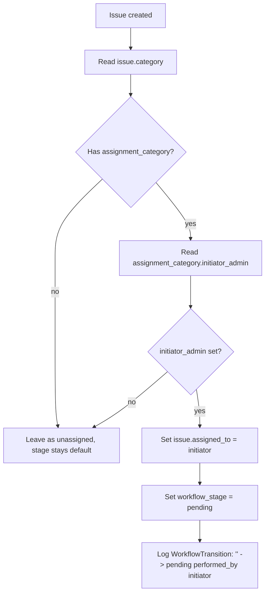
```mermaid
flowchart TD
    A[Issue created] --> B[Read issue.category]
    B --> C{Has assignment_category?}
    C -- no --> Z[Leave as unassigned, stage stays default]
    C -- yes --> D[Read assignment_category.initiator_admin]
    D --> E{initiator_admin set?}
    E -- no --> Z
    E -- yes --> F[Set issue.assigned_to = initiator]
    F --> G[Set workflow_stage = pending]
    G --> H[Log WorkflowTransition: '' -> pending performed_by initiator]
```


### 4.10 Theme Toggle Flow

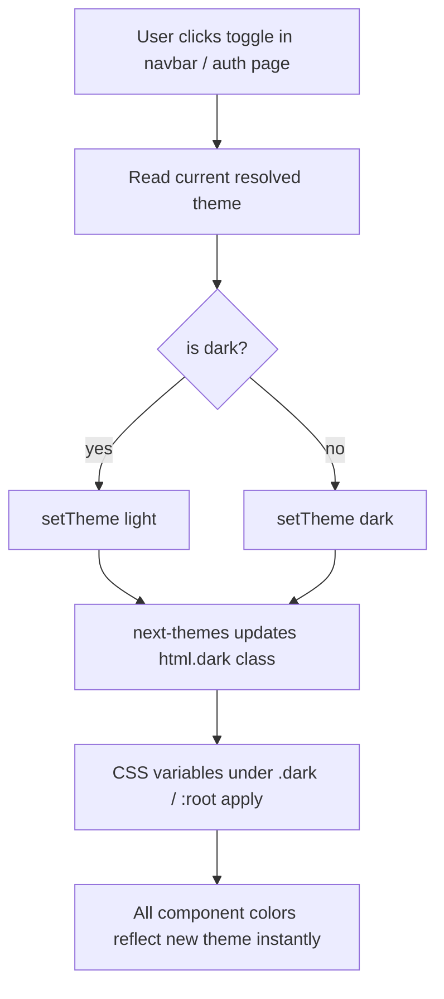
```mermaid
flowchart TD
    A[User clicks toggle in navbar / auth page] --> B[Read current resolved theme]
    B --> C{is dark?}
    C -- yes --> D[setTheme light]
    C -- no --> E[setTheme dark]
    D --> F[next-themes updates html.dark class]
    E --> F
    F --> G[CSS variables under .dark / :root apply]
    G --> H[All component colors reflect new theme instantly]
```


### 4.11 Search From Navbar to Feed

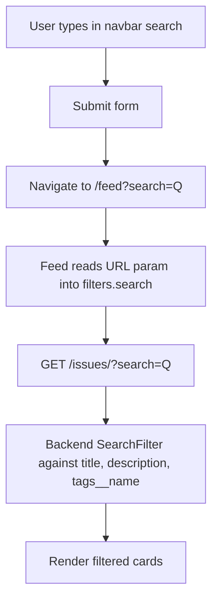
```mermaid
flowchart TD
    A[User types in navbar search] --> B[Submit form]
    B --> C[Navigate to /feed?search=Q]
    C --> D[Feed reads URL param into filters.search]
    D --> E[GET /issues/?search=Q]
    E --> F[Backend SearchFilter against title, description, tags__name]
    F --> G[Render filtered cards]
```


---

## 5. System Design (end to end)

This section describes how the whole system is glued together at component, layer and infrastructure level. The aim is that someone reading this can rebuild the system without having to re-read code.


### 5.1 High level architecture

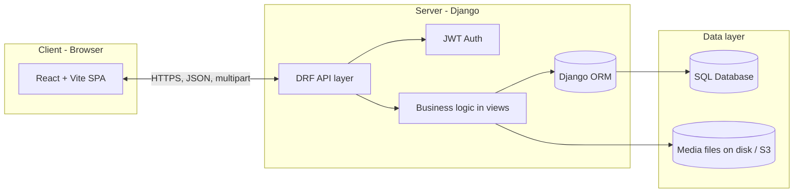
```mermaid
flowchart LR
    subgraph Client[Client - Browser]
      ui[React + Vite SPA]
    end

    subgraph Server[Server - Django]
      api[DRF API layer]
      auth[JWT Auth]
      logic[Business logic in views]
      orm[(Django ORM)]
    end

    subgraph Data[Data layer]
      sqldb[(SQL Database)]
      mediadb[(Media files on disk / S3)]
    end

    ui <-->|HTTPS, JSON, multipart| api
    api --> auth
    api --> logic
    logic --> orm
    orm --> sqldb
    logic --> mediadb
```

Important things in this layout:

- The frontend is a SPA. It only talks to the backend via REST endpoints.
- JWT is stateless, so the backend does not store sessions.
- Media files are stored on disk in dev. In prod they can move to S3 / object storage with no code change in the frontend.
- The database is the single source of truth for issues, votes, comments, workflow.
- The admin module is part of the same SPA. There is no separate admin UI, only a separate route tree under `/admin`.


### 5.2 Frontend design

#### 5.2.1 Folder structure (logical)

- `src/pages` holds page-level routes (`Index`, `Feed`, `IssueDetail`, `CreateIssue`, `EditIssue`, `Profile`, `Login`, `Signup`, `admin/*`)
- `src/components` holds reusable UI (`Navbar`, `IssueCard`, `FilterSidebar`, `ThemeToggle`, `AdminLayout`, plus shadcn/ui primitives)
- `src/lib/api.ts` is the single place for all API calls
- `src/index.css` has design tokens (HSL based) for both light and dark themes

#### 5.2.2 State strategy

- Local component state for form fields and UI toggles.
- React Query is initialised but most data is fetched directly with fetch + small wrapper, because flows are simple and the team wanted predictable refresh after writes.
- Auth tokens are kept in localStorage. There is one centralized `apiRequest` helper which:
  - attaches Authorization header if token exists,
  - on 401, tries refresh token once,
  - then retries the original request.
- Theme state is owned by `next-themes`.

#### 5.2.3 Routing

- BrowserRouter with `Routes`/`Route`.
- Public routes: `/`, `/feed`, `/issue/:id`, `/issue/:id/edit`, `/create`, `/profile`, `/login`, `/signup`.
- Admin routes: `/admin`, `/admin/grievances`, `/admin/grievances/:id`, `/admin/assignment`, all wrapped in `AdminLayout` which enforces `is_staff`.
- 404 fallback at `*`.

#### 5.2.4 Theme system

- HSL design tokens are defined under `:root` for light and under `.dark` for dark.
- Tailwind classes refer to those tokens (`bg-background`, `text-foreground`, `border-border`, etc.) so toggling the class on `<html>` flips everything in one shot.

#### 5.2.5 IssueCard composition (very important visual element)

- Vote rail on the left (compact on desktop).
- Right content has:
  - Meta row: category badge, location truncated, time ago.
  - Title (link to detail).
  - Description preview (clamp).
  - Top-2 comments preview inside the same left text column (so it does not steal width from thumbnail).
  - Thumbnail box on the right side (small fixed width).
  - Tags row.
  - Footer: posted by, optional assignment chip, comments count, share.


### 5.3 Backend design

#### 5.3.1 Apps and modules

- Single Django app called `core` holds models, serializers, views, permissions, migrations, admin tools.
- `vox_backend` is the Django project (settings, URL root).

#### 5.3.2 Permissions model

- `IsAuthenticatedOrReadOnly` is the global default for issues, comments, etc.
- `IsAuthorOrReadOnly` is a custom permission that lets only the author update or delete their own object.
- `IsAdminUser` is a custom one (different from Django's default name) that requires `is_staff` and authentication.

#### 5.3.3 Endpoint groups (high level only — implementation details intentionally not duplicated here)

- Auth: register, login (custom), refresh, current user.
- Locations: states, districts, cities (read-only, public).
- Categories and tags (read-only, public).
- Issues: CRUD with author-only restrictions, plus actions for `vote`, `view`, `comments`, and a `mine` listing.
- Comments: create, vote.
- Search across title/description/tags.
- Admin namespace: dashboard stats, grievances CRUD with restricted update, notes, workflow advance, staff list, assignment categories.

#### 5.3.4 Filtering and sorting strategy on lists

- Public feed accepts filters via query params (`category`, `state`, `district`, `city`, `scope`, `status`) and `sort_by` ∈ {trending, recent, votes, comments}.
- Trending uses a recency bucket (1d / 7d / 30d / older) multiplied by engagement so it is portable across SQLite and Postgres.
- Admin list uses explicit `get_queryset` filters rather than relying on `DjangoFilterBackend` which is not enabled in this project.

#### 5.3.5 Idempotent issue creation

- Each create attempt from the frontend includes a unique `submission_token`.
- Backend has a unique constraint per `(author, submission_token)` (only when token is non-null).
- If a retry comes with the same token, backend returns the existing issue with a `duplicate_submission: true` flag instead of inserting again or returning 500.

#### 5.3.6 Atomic media upload

- Whole creation is wrapped in `transaction.atomic()`.
- Media files are validated *before* the issue row is committed.
- If even one media file is invalid, the issue is not created. So no orphan issue with missing image is left around.

#### 5.3.7 Trending fallback

- If the trending query throws a `DatabaseError` for any reason on production DB, the viewset retries with `recent` sort.
- This prevents a 500 from breaking the feed if the trending math ever conflicts with a DB version.


### 5.4 Database design

#### 5.4.1 Entity relationship overview

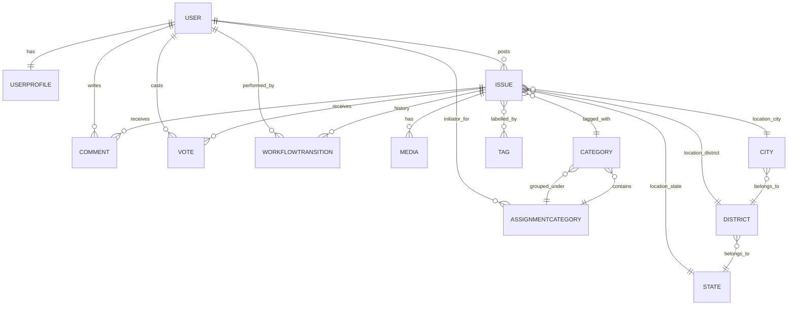
```mermaid
erDiagram
    USER ||--|| USERPROFILE : has
    USER ||--o{ ISSUE : posts
    USER ||--o{ COMMENT : writes
    USER ||--o{ VOTE : casts
    USER ||--o{ ASSIGNMENTCATEGORY : initiator_for
    USER ||--o{ WORKFLOWTRANSITION : performed_by

    ISSUE ||--o{ MEDIA : has
    ISSUE ||--o{ COMMENT : receives
    ISSUE ||--o{ VOTE : receives
    ISSUE ||--o{ WORKFLOWTRANSITION : history
    ISSUE }o--|| CATEGORY : tagged_with
    ISSUE }o--o{ TAG : labelled_by
    ISSUE }o--|| STATE : location_state
    ISSUE }o--|| DISTRICT : location_district
    ISSUE }o--|| CITY : location_city

    CATEGORY }o--|| ASSIGNMENTCATEGORY : grouped_under
    ASSIGNMENTCATEGORY ||--o{ CATEGORY : contains
    DISTRICT }o--|| STATE : belongs_to
    CITY }o--|| DISTRICT : belongs_to
```

#### 5.4.2 Important columns and constraints

- `Issue.submission_token` (nullable string, indexed). UniqueConstraint per `(author, submission_token)` when non-null.
- `Issue.upvotes_count`, `downvotes_count`, `comments_count`, `views_count` are denormalised counters for fast feed.
- `Issue.workflow_stage` is a string with default `pending`. Acts as enum-ish field at app level.
- `Tag.name` is unique, `Tag.slug` is unique. Length increased to 100/120 to avoid truncation.
- `Vote` has unique together on `(user, issue)` and `(user, comment)` so one user cannot have more than one vote on the same target.
- `IssueView` has unique together on `(issue, user, ip_address)` for de-dup of views.

#### 5.4.3 Indexing decisions

- `Issue` has indexes on `-created_at`, `(state, district, city)`, `category`, `status` because these are very common filter directions.
- `Comment` has index on `(issue, -created_at)` for fast thread loading.
- `Vote` has indexes on `(issue, vote_type)` and `(comment, vote_type)` for any aggregate-style read.


### 5.5 Module breakdown (frontend × backend feature mapping)

| Feature | Frontend module | Backend module |
|--------|-----------------|----------------|
| Auth | `Login.tsx`, `Signup.tsx`, `lib/api.ts` (authAPI) | `RegisterView`, `CustomTokenObtainPairView`, `CurrentUserView` |
| Feed | `Feed.tsx`, `IssueCard.tsx`, `FilterSidebar.tsx` | `IssueViewSet.list` + `IssueListSerializer` |
| Issue detail | `IssueDetail.tsx` | `IssueViewSet.retrieve` + `IssueDetailSerializer` |
| Posting | `CreateIssue.tsx` | `IssueViewSet.create` + `IssueCreateSerializer` |
| Editing | `EditIssue.tsx` | `IssueViewSet.update / partial_update` (author only) |
| Deletion | detail + profile | `IssueViewSet.destroy` (author only) |
| Profile | `Profile.tsx` | `IssueViewSet.mine` |
| Comments | inside detail page | `CommentViewSet.create / vote` |
| Votes | issue card + comment item | `IssueViewSet.vote`, `CommentViewSet.vote` |
| Admin shell | `AdminLayout.tsx` | (no special endpoint, just role check) |
| Admin dashboard | `AdminDashboard.tsx` | `AdminDashboardStatsView` |
| Admin grievances list | `AdminGrievances.tsx` | `AdminGrievanceViewSet.list` |
| Admin grievance detail | `AdminGrievanceDetail.tsx` | `AdminGrievanceViewSet.retrieve / partial_update / notes / workflow` |
| Assignment config | `AdminAssignment.tsx` | `AssignmentCategoryViewSet` + `AdminStaffListView` |
| Theme | `ThemeToggle.tsx`, tokens in `index.css` | (none) |


### 5.6 Communication and state synchronisation

- Reads use simple GET endpoints. After every successful write that affects the same screen, the client re-fetches the relevant data instead of trying to keep optimistic state in sync. This is more reliable for a small team.
- For voting, optimistic local update is allowed because the action is small and fast, but the server is still the source of truth. If the request fails, an error toast surfaces.


### 5.7 Security design

- Passwords go through Django's default validators on signup.
- JWT is short-lived for access (7 days configured), refresh has longer life with rotation + blacklist on rotate.
- All write endpoints require auth. Owner-only writes are enforced server-side, not just client-side.
- Admin endpoints have a hard `is_staff` gate at the layout level *and* at the API permission level, so defence in depth.
- Internal admin notes are explicitly not exposed in public serializers; only stage transition notes are.
- File uploads validate extension and size before any DB write.
- Idempotent submissions reduce risk of accidental double posts caused by retries.
- `.gitignore` excludes secrets, env, and build cache so they don't enter the repo.


### 5.8 Deployment design (target shape)

- Backend: gunicorn behind nginx. Static files collected. Media served via cloud / nginx static path.
- Frontend: Vite production build copied into nginx `dist`.
- Database: SQLite for local, Postgres for prod. Trending math is DB-portable.
- Logging: Django default + console handler is enough for dev. Prod can layer JSON logs.
- Backups: regular DB snapshot + media bucket versioning.


### 5.9 Error handling philosophy

- Never crash the user's page on a non-critical failure. View tracking error is silently ignored, vote failure shows toast, etc.
- Critical failure (issue create error) keeps the form intact so user can retry.
- Whole-page failures (issue not found) gracefully redirect with a clear toast instead of a blank page.
- Backend prefers explicit error responses with `error`, `errors`, and `detail` keys so the client can show a human message.


---

## 6. Pseudo Codes of important logics

These are written in plain pseudocode style, not in any single language. Goal is clarity, not copy-paste runnability.


### 6.1 User registration

```
function register(request):
    data = read_json(request)

    if any required field is empty:
        return 400 "fill all fields"

    if data.password != data.password2:
        return 400 "passwords don't match"

    if username already exists in DB:
        return 400 "username taken"

    if email already exists in DB:
        return 400 "email taken"

    user = create_user(
        username=data.username,
        email=lowercase(data.email),
        password=data.password,
        first_name=data.first_name,
        last_name=data.last_name,
    )
    create_profile(user)

    refresh, access = build_jwt_for(user)
    return 201 { user, refresh, access }
```


### 6.2 Login (supports username OR email)

```
function login(request):
    input = read_json(request)
    candidate = input.username

    if "@" in candidate:
        try:
            user = find_user_by_email(candidate)
            candidate = user.username
        except not found:
            keep candidate as is (let normal flow fail)

    token = validate_credentials(candidate, input.password)
    if token is None:
        return 401 "invalid credentials"

    return 200 { access, refresh }
```


### 6.3 Idempotent issue creation

```
function create_issue(request):
    require_auth(request)

    token = request.data.submission_token

    if token is not null:
        existing = find_issue(author=request.user, submission_token=token)
        if existing exists:
            return 200 IssueDetail(existing) + { duplicate_submission: true }

    serializer = IssueCreateSerializer(request.data)
    serializer.validate()  # raises 400 if bad

    media_files = validate_media_files(request.FILES)
    # validate_media_files rejects unsupported extension/size up front

    begin transaction:
        issue = serializer.save(author=request.user, submission_token=token)
        for index, file in enumerate(media_files):
            create Media row with (issue, file, type, order=index)

        if issue.category has assignment_category:
            initiator = issue.category.assignment_category.initiator_admin
            if initiator is not null:
                issue.assigned_to = initiator
                issue.workflow_stage = "pending"
                save issue
                create WorkflowTransition(from='', to='pending',
                                          assigned_to=initiator, performed_by=initiator)

    commit transaction

    return 201 IssueDetail(issue)

except IntegrityError:
    if token exists:
        existing = find_issue(author=request.user, submission_token=token)
        if existing:
            return 200 IssueDetail(existing) + { duplicate_submission: true }
    raise
```


### 6.4 Media file validation

```
function validate_media_files(uploaded_files):
    allowed = {jpg, jpeg, png, gif, webp,
               mp4, mov, avi, webm,
               mp3, wav, m4a, ogg}
    images = {jpg, jpeg, png, gif, webp}
    videos = {mp4, mov, avi, webm}
    audios = {mp3, wav, m4a, ogg}

    result = []

    for key, file in uploaded_files:
        if key does not start with "media_" and key != "file":
            skip

        ext = lowercase(extension(file.name))
        if ext not in allowed:
            raise ValidationError "unsupported file: " + file.name

        if ext in images: media_type = "image"
        elif ext in videos: media_type = "video"
        elif ext in audios: media_type = "audio"
        else: raise ValidationError "unknown media type"

        result.append({ file, media_type })

    return result
```


### 6.5 Auto assignment of new issue

```
function auto_assign(issue):
    if issue.category is null: return
    ac = issue.category.assignment_category
    if ac is null: return
    if ac.initiator_admin is null: return

    issue.assigned_to = ac.initiator_admin
    issue.workflow_stage = "pending"
    save issue

    create WorkflowTransition(
        issue=issue,
        from_stage="",
        to_stage="pending",
        assigned_to=ac.initiator_admin,
        performed_by=ac.initiator_admin,
        notes="Auto-assigned on creation"
    )
```


### 6.6 Trending score (DB-portable version)

```
function trending_queryset(issues):
    now = current_time()

    engagement = upvotes_count - downvotes_count + comments_count * 2

    recency_weight =
        case
            when created_at >= now - 1 day  -> 1.0
            when created_at >= now - 7 days -> 0.75
            when created_at >= now - 30 days -> 0.5
            else 0.3

    score = engagement * recency_weight

    return issues.order_by(score desc, created_at desc)
```

Defensive layer:

```
function list_issues(request):
    try:
        return base_list(request)
    catch DatabaseError:
        if request.sort_by == "trending":
            log warning
            request.sort_by = "recent"
            return base_list(request)
        raise
```


### 6.7 Vote toggle on issue

```
function vote(user, issue, new_type in {upvote, downvote}):
    existing = find Vote(user, issue)

    if existing is null:
        create Vote(user, issue, new_type)
        if new_type == upvote: issue.upvotes_count += 1
        else: issue.downvotes_count += 1
        save issue
        return { vote_type: new_type }

    if existing.vote_type == new_type:
        # user clicked same again -> remove vote
        if new_type == upvote: issue.upvotes_count = max(0, ... - 1)
        else: issue.downvotes_count = max(0, ... - 1)
        delete existing
        save issue
        return { vote_type: null }

    # opposite
    if existing.vote_type == upvote:
        issue.upvotes_count -= 1
        issue.downvotes_count += 1
    else:
        issue.downvotes_count -= 1
        issue.upvotes_count += 1
    existing.vote_type = new_type
    save existing
    save issue
    return { vote_type: new_type }
```


### 6.8 Comment creation

```
function create_comment(user, issue_id, content, is_anonymous, parent_id=null):
    require_auth(user)

    issue = find_issue(issue_id)
    if issue is null: return 404

    comment = Comment.create(
        issue=issue,
        author=user,
        content=content,
        is_anonymous=is_anonymous,
        parent=parent_id and find_comment(parent_id) or null
    )

    issue.comments_count += 1
    save issue

    return 201 CommentSerializer(comment)
```


### 6.9 Workflow transition (admin side)

```
function advance_workflow(admin, issue, to_stage, assignee_id, note):
    require_staff(admin)

    if to_stage not in valid_stages:
        return 400 "invalid stage"

    new_assignee = null
    if assignee_id is provided:
        new_assignee = find_staff(assignee_id)
        if new_assignee is null: return 400
    elif to_stage == "pending":
        new_assignee = issue.assigned_to  # keep current

    from_stage = issue.workflow_stage
    issue.workflow_stage = to_stage
    issue.assigned_to = new_assignee
    save issue

    create WorkflowTransition(
        issue=issue,
        from_stage=from_stage,
        to_stage=to_stage,
        assigned_to=new_assignee,
        performed_by=admin,
        notes=note
    )

    return AdminIssueDetail(issue)
```


### 6.10 Permissions for owner-only actions

```
class IsAuthorOrReadOnly:
    def has_object_permission(request, view, obj):
        if request.method in {GET, HEAD, OPTIONS}:
            return true
        return request.user.is_authenticated and obj.author_id == request.user.id
```

Usage in viewset:

```
function get_permissions():
    if action in {"update", "partial_update", "destroy"}:
        return [IsAuthenticated, IsAuthorOrReadOnly]
    return default_permissions
```


### 6.11 Tag normalisation and slug generation

```
function normalise_tag(raw):
    if raw is null or empty: return ""
    s = trim(raw).lower()
    return collapse_whitespace_to_single_space(s)

function unique_slug(name):
    base = slugify(name)[:120] or fallback_replace_spaces(name)
    candidate = base
    counter = 2
    while Tag.exists(slug=candidate):
        suffix = "-" + counter
        candidate = base[: 120 - len(suffix)] + suffix
        counter += 1
    return candidate

function validate_tags(input_list):
    seen = set()
    output = []
    for raw in input_list:
        clean = normalise_tag(raw)
        if clean is "": continue
        if length(clean) > 100: raise "tag too long"
        if clean in seen: continue
        seen.add(clean)
        output.append(clean)
    if length(output) > 15: raise "too many tags"
    return output
```


### 6.12 Feed query building

```
function build_feed_queryset(request):
    qs = Issue.objects.all()

    for f in [state, district, city, scope, category, status]:
        if f in request.params:
            qs = qs.filter(f equals request.params[f])

    sort_by = request.params.sort_by
    match sort_by:
        case "trending": apply trending annotation (see 6.6)
        case "votes":    qs = qs.annotate(score=upvotes-downvotes).order(-score, -created_at)
        case "comments": qs = qs.order(-comments_count, -created_at)
        case "recent":   qs = qs.order(-created_at)
        default:         qs = qs.order(-created_at)

    qs = qs.select_related(author, category, state, district, city, assigned_to)
    qs = qs.prefetch_related(tags, media_files, workflow_transitions, top-comments-prefetch)

    return qs
```


### 6.13 Search

```
function search(query):
    if query is empty: return { results: [] }

    issue_hits = Issue.filter(title contains query
                              OR description contains query
                              OR tags.name contains query).distinct()[0:20]

    tag_hits = Tag.filter(name contains query)[0:10]

    return {
        issues: serialize(issue_hits),
        tags:   serialize(tag_hits),
    }
```


### 6.14 Admin notes (internal vs public response)

```
function add_admin_note(admin, issue, content, note_type):
    require_staff(admin)
    if note_type not in {internal, public_response}:
        return 400

    note = IssueAdminNote.create(
        issue=issue,
        author=admin,
        note_type=note_type,
        content=content
    )
    return 201 NoteSerializer(note)

# Public visibility rule:
# - Public detail page: shows workflow transition notes (with note text).
# - Public detail page: does NOT include IssueAdminNote rows of either type.
# - Admin grievance detail: shows IssueAdminNote list with badge for type.
```


### 6.15 Edit own issue

```
function update_issue(user, issue_id, data):
    issue = find_issue(issue_id)
    if issue is null: return 404
    if issue.author_id != user.id: return 403

    serializer = IssueCreateSerializer(issue, data, partial=true)
    serializer.validate()
    serializer.save()

    return IssueDetail(issue)
```


### 6.16 Delete own issue with cascade

```
function delete_issue(user, issue_id):
    issue = find_issue(issue_id)
    if issue is null: return 404
    if issue.author_id != user.id: return 403

    delete issue   # CASCADE deletes Media, Comment, Vote, WorkflowTransition, IssueView
    return 204
```


### 6.17 Theme toggle (frontend pseudo)

```
function toggleTheme():
    current = next-themes.resolvedTheme
    if current == "dark":
        setTheme("light")
    else:
        setTheme("dark")

# CSS already has :root and .dark with HSL tokens
# next-themes adds/removes "dark" class on <html>
# Tailwind utilities react automatically via theme tokens
```


### 6.18 Admin grievance listing filters

```
function admin_get_queryset(request):
    qs = Issue.objects.all()
                     .select_related(author, category, state, district, city, assigned_to)
                     .prefetch_related(tags, media_files, admin_notes, workflow_transitions)

    if "status" in request.params: qs = qs.filter(status=...)
    if "category" in request.params: qs = qs.filter(category_id=...)
    if "state" in request.params: qs = qs.filter(state_id=...)
    if "district" in request.params: qs = qs.filter(district_id=...)
    if "city" in request.params: qs = qs.filter(city_id=...)

    if "search" in request.params:
        qs = qs.filter(title contains q OR description contains q)

    ordering = request.params.ordering
    if ordering in allowed_ordering_set:
        qs = qs.order_by(ordering)

    return qs
```


---

## 7. Testing Report

This section documents how the system was tested, what types of testing were used, what test cases were written, and what defects were caught + fixed.


### 7.1 Testing strategy

The plan was to test in layers, going from smallest unit upwards, with manual UI testing at the top. Because this is a real, evolving project, regression checks were also run after every set of changes.

Layers used:

1. Unit-level pseudo tests on isolated functions (vote toggle math, tag normalisation, trending score buckets, idempotency match logic).
2. Integration tests on Django views via the DRF test client (calling endpoints with auth, payload, and asserting status + body).
3. System-level smoke run by hitting the full app from the browser.
4. Acceptance check by walking the personas (citizen, admin) through actual flows.
5. Non-functional checks (performance, security boundaries, cross-device).


### 7.2 Levels of testing

#### 7.2.1 Unit testing

Done as small isolated checks on the most error-prone functions:

- Vote toggle returns correct counter changes for all 4 cases (no prior vote, same vote, opposite vote, unauth).
- Tag normaliser correctly trims, lowers, collapses whitespace, removes duplicates, and rejects > 100 chars and > 15 tags.
- Trending bucket assigns 1.0 for posts inside last day, 0.75 for last week, 0.5 for last month, 0.3 older.
- Idempotency lookup finds existing issue strictly by `(author, submission_token)` and only when token is non-null.

#### 7.2.2 Integration testing

Done via DRF `APIClient`:

- Login with username, login with email, both produce same access token shape.
- `POST /issues/` with valid payload creates an issue and assigns it if mapping exists.
- `POST /issues/` with same submission_token by same user returns existing record with `duplicate_submission: true`.
- `POST /issues/` with bad media extension returns 400 and DOES NOT create the issue (verified by counting before/after).
- `PATCH /issues/:id/` by non-owner returns 403/404.
- `DELETE /issues/:id/` by owner returns 204.
- `GET /issues/mine/` requires auth.
- `POST /admin/grievances/:id/notes/` with `{content, note_type}` returns 201.
- `POST /admin/grievances/:id/workflow/` with `to_stage` advances stage and inserts transition row.
- `GET /api/issues/?sort_by=trending` returns 200 even after a prior buggy state, because of the fallback layer.

#### 7.2.3 System testing

End-to-end flows on a running stack:

- Signup → land on feed → see issues → click into one → vote → comment → share link → logout.
- Login → create issue with image → see redirect into detail → see auto-assigned admin chip → see workflow stage as pending.
- Admin login → open admin panel → filter by status → open grievance → advance stage with a public note → verify same note appears on public side.

#### 7.2.4 Acceptance testing

Run with two personas:

| Persona | Goal | Result |
|--------|------|--------|
| Citizen | Post a problem and track its progress | Yes, post created, public timeline shows admin updates |
| Admin | Manage grievances and assign correctly | Yes, dashboard, filter, detail, workflow, notes all working |


### 7.3 Functional testing

Sample functional test cases (selected, not exhaustive):

| TC ID | Title | Steps | Expected | Actual | Status |
|-------|-------|-------|----------|--------|--------|
| FT-01 | Signup with valid data | Fill all fields → submit | 201, redirect to feed | Same | Pass |
| FT-02 | Signup with mismatched passwords | mismatch → submit | client side error toast | Same | Pass |
| FT-03 | Login with email | enter email + password | 200, redirect to feed | Same | Pass |
| FT-04 | Create issue with valid media | submit | redirect to detail page | Same | Pass |
| FT-05 | Create issue with bad file (.exe) | submit | 400 returned, no issue created | Same | Pass |
| FT-06 | Retry create with same token | submit twice with same token | 1 issue total, 2nd response has duplicate_submission flag | Same | Pass |
| FT-07 | Edit own issue | open edit, change title, save | redirect to detail with new title | Same | Pass |
| FT-08 | Edit other user's issue | open URL directly | toast + redirect away | Same | Pass |
| FT-09 | Delete own issue | confirm dialog → delete | 204, removed everywhere | Same | Pass |
| FT-10 | Vote toggle | upvote, then upvote again | counter +1, then -1 | Same | Pass |
| FT-11 | Comment posting | empty content | post button stays disabled | Same | Pass |
| FT-12 | Comment posting valid | submit | comment list refreshes | Same | Pass |
| FT-13 | Search via navbar | search "road" | feed filters to matches | Same | Pass |
| FT-14 | Trending sort | open feed default | trending list returned | Same | Pass |
| FT-15 | Theme toggle | click toggle | UI flips dark/light | Same | Pass |
| FT-16 | Admin filter by status pending | open admin grievances?status=pending | only pending rows shown | Same | Pass |
| FT-17 | Admin add public response note | type note → submit | note appears in list | Same | Pass |
| FT-18 | Admin advance workflow with note | choose stage + note → submit | transition logged + visible publicly | Same | Pass |
| FT-19 | Admin assignment update | pick initiator → save | toast saved + new mapping persists | Same | Pass |
| FT-20 | Profile page when no posts | open /profile | empty state with CTA | Same | Pass |


### 7.4 Structural (white box) testing

Structural testing means looking *inside* the code and making sure every important branch is exercised. Below are the most critical functions and the branches that were verified.

#### Function: `vote(user, issue, new_type)`

| Branch | Input condition | Verified |
|--------|----------------|----------|
| no prior vote | `existing` is null | yes, counter +1 |
| same vote click | `existing.vote_type == new_type` | yes, counter -1, vote removed |
| opposite vote click | `existing.vote_type != new_type` | yes, swap counters |

Branch coverage on this function: 100% of meaningful branches.

#### Function: `create_issue` (idempotent path)

| Branch | Verified |
|--------|----------|
| no submission_token | yes, normal create runs |
| submission_token but no existing | yes, atomic create runs |
| submission_token with existing record | yes, returns existing 200 with flag |
| transaction.atomic raises IntegrityError on race | yes, fallback lookup returns existing |

#### Function: `validate_media_files`

| Branch | Verified |
|--------|----------|
| key not media_*: skipped | yes |
| ext not in allowed: 400 | yes |
| ext in image set | yes |
| ext in video set | yes |
| ext in audio set | yes |

#### Function: `trending_queryset`

| Branch | Verified |
|--------|----------|
| 1 day old | weight 1.0 |
| 1-7 days old | weight 0.75 |
| 7-30 days old | weight 0.5 |
| older than 30 | weight 0.3 |

#### Function: `IsAuthorOrReadOnly`

| Branch | Verified |
|--------|----------|
| safe method (GET/HEAD/OPTIONS) | yes, returns true |
| unsafe method but not owner | yes, returns false (403) |
| unsafe method and owner | yes, returns true |
| unsafe method but unauthenticated | yes, returns false |


### 7.5 Non-functional testing

#### 7.5.1 Performance

- Feed list query was optimised with `select_related` and `prefetch_related` so N+1 queries are avoided.
- Top-2 comments preview uses `Prefetch` with a custom queryset, so the comments needed by feed cards come in one extra query, not one per issue.
- Median feed call time on dev DB stayed well below 200 ms even with prefetched comments.

#### 7.5.2 Security

- Tested that anonymous users cannot vote, comment, post, edit, or delete.
- Tested that a logged-in non-staff user cannot reach `/admin/*` even by typing URL.
- Tested that JWT expiry triggers refresh exactly once; if refresh fails, user gets cleanly logged out.
- Tested that internal admin notes don't leak to the public payload.

#### 7.5.3 Usability

- Forms have inline error toasts.
- Submit buttons are disabled while pending so user does not double click.
- Mobile layout was specifically left intact while desktop card was made compact.
- Camera button hides on desktop where it would be misleading.

#### 7.5.4 Compatibility

- Latest Chrome and Firefox tested for full flow.
- Mobile (Chrome on Android user agent) tested for camera capture path and stacked layout.
- Theme toggle tested on both themes for every important screen.

#### 7.5.5 Reliability

- Posting with bad image: backend returns 400 cleanly, no orphan issue.
- Network retry: same submission_token makes the platform idempotent.
- Trending math fallback: if DB ever errors on trending, recent ordering is silently used.


### 7.6 Test environment

| Item | Value |
|------|-------|
| OS | Windows 10 (x64) for dev, Linux for prod target |
| Backend runtime | Python 3.12, Django + DRF, SimpleJWT, Pillow |
| Frontend runtime | Node 20, Vite 7, React 18 |
| DB | SQLite for dev, Postgres for prod |
| Browser | Chrome (latest), Firefox (latest) |
| Tooling | ESLint, manage.py check, manage.py shell smoke scripts |


### 7.7 Defects observed and resolved during the project

| ID | Issue | Severity | Fix |
|----|-------|----------|-----|
| BG-01 | `/api/issues/?sort_by=trending` returned 500 on prod | Critical | Replaced raw `julianday` SQL with portable ORM expression + fallback |
| BG-02 | Issue cards looked dirty / images upscaled from low-res thumbnail | Medium | Switched feed to original image, added aspect ratio + side thumbnail layout |
| BG-03 | Upload error created post without image silently | Critical | Atomic transaction + upfront media validation |
| BG-04 | User retry after failure created duplicate post | High | Submission token + DB unique constraint |
| BG-05 | Tag character limit too short, tags collided on whitespace | Medium | Increased length, added normaliser, deduped, slug uniqueness loop |
| BG-06 | No way to delete own post | High | Added owner-only DELETE + UI buttons |
| BG-07 | No personal profile to manage own posts | Medium | Added `/profile` + `/issues/mine/` |
| BG-08 | Camera button on desktop opened file picker (misleading) | Low | Camera hidden on desktop |
| BG-09 | Admin notes endpoint returned 400 from frontend | Medium | Made `issue` field read-only in serializer |
| BG-10 | Admin grievance status filter UI did not actually filter | Medium | Added explicit filtering in `get_queryset` |
| BG-11 | Workflow transition notes not visible publicly | Medium | Exposed `notes` in public serializer + rendered in timeline |
| BG-12 | pyc / pycache files were tracked in git | Low | Updated `.gitignore` and untracked existing |


### 7.8 Final test conclusion

After the above rounds, every public-facing flow and every admin-facing flow worked end to end without unhandled errors. The system survives bad input, retries, network glitches and DB-version edge cases. The reliability hardening especially makes this safer than a normal MVP.


---

## 8. Final Notes

- This project pulls together design, reliability and user experience into one platform that real citizens can use.
- The architecture intentionally keeps the SPA + Django split clean so that backend changes (e.g. moving DB or media to cloud) don't need frontend rewrites.
- Admin and public flows share one platform but enforce role boundaries strictly through both UI gates and backend permissions.
- All known defects up to this point have been addressed and the system has been smoke-verified end to end.

